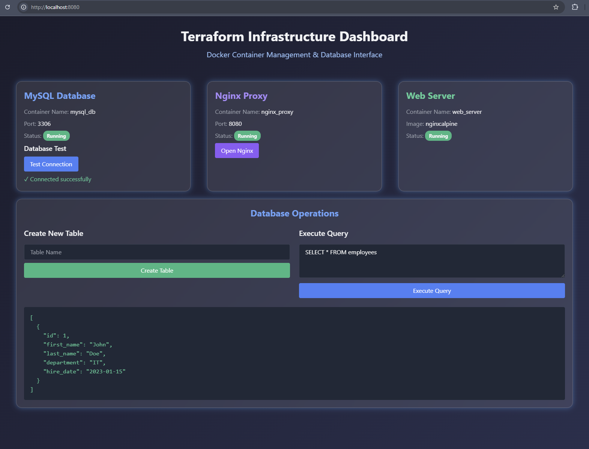

# Terraform Local Multi-Container Application with Interactive Database Dashboard



*Author: Panagiotis Georgiadis*

## Overview

This project demonstrates infrastructure as code using Terraform to create a local multi-container environment with an interactive web dashboard. The dashboard allows users to manage database operations through a modern, user-friendly interface.


## Project Structure

```
terraform_practice/
├── modules/                 # Directory containing all modular components of the infrastructure
│   ├── db/                 # MySQL database module configuration
│   │   ├── data/          # MySQL persistent data directory (managed by Docker)
│   │   │   └── ...        # Other MySQL system and data files
│   │   ├── main.tf        # Main database container configuration
│   │   ├── outputs.tf     # Database output variables (container ID, etc.)
│   │   └── variables.tf   # Database module variables (image, password, etc.)
│   ├── network/           # Docker network module for container communication
│   │   ├── main.tf        # Network configuration (bridge network setup)
│   │   ├── outputs.tf     # Network output variables (network ID)
│   │   └── variables.tf   # Network module variables (network name, etc.)
│   ├── nginx/             # Nginx with PHP module for web interface
│   │   ├── html/          # Web root directory
│   │   │   ├── create-table.php   # PHP script for table creation
│   │   │   ├── execute-query.php  # PHP script for SQL query execution
│   │   │   ├── index.html         # Main dashboard interface
│   │   │   └── test-connection.php # Database connection test script
│   │   ├── main.tf        # Nginx container configuration
│   │   ├── outputs.tf     # Nginx output variables
│   │   └── variables.tf   # Nginx module variables
│   └── web/               # Additional web server module
│       ├── main.tf        # Web server container configuration
│       ├── outputs.tf     # Web server output variables
│       └── variables.tf   # Web server module variables
├── main.tf                # Root configuration file that calls all modules
├── outputs.tf            # Root output variables
├── providers.tf          # Provider configuration (Docker provider)
├── variables.tf          # Root variables declaration
├── terraform.tfvars      # Variable values for the root module
├── terraform.tfstate     # Current state of the infrastructure
├── terraform.tfstate.backup # Backup of previous state
└── README.md             # Project documentation
```

## Prerequisites

- Terraform installed
- Docker installed and configured with WSL2
- Ubuntu 24.04.1 LTS on WSL2

## Setup Instructions

1. Clone the repository
2. Navigate to the project directory
3. Initialize Terraform:
```bash
terraform init
```
4. Apply the configuration:
```bash
terraform apply
```

## Features

The dashboard provides:
- Real-time container status monitoring
- Database connection testing
- SQL query execution interface
- Table creation functionality
- Modern, responsive UI with dark theme

## Container Details

1. **MySQL Database (modules/db)**
   - Container Name: mysql_db
   - Port: 3306
   - Root Password: password (for demonstration only)
   - Persistent data storage in modules/db/data/

2. **Nginx Proxy (modules/nginx)**
   - Container Name: nginx_proxy
   - Port: 8080
   - Image: webdevops/php-nginx:8.1-alpine
   - Serves PHP files from modules/nginx/html/

3. **Web Server (modules/web)**
   - Container Name: web_server
   - Image: nginx:alpine

4. **Network (modules/network)**
   - Name: terraform_network
   - Type: bridge network
   - Connects all containers

## Testing the Setup

1. Access the dashboard at http://localhost:8080
2. Test database connectivity using the "Test Connection" button
3. Create a sample table:
```sql
CREATE TABLE employees (
    id INT AUTO_INCREMENT PRIMARY KEY,
    first_name VARCHAR(50),
    last_name VARCHAR(50),
    department VARCHAR(50),
    hire_date DATE
)
```
4. Insert sample data:
```sql
INSERT INTO employees (first_name, last_name, department, hire_date) 
VALUES 
('John', 'Doe', 'IT', '2023-01-15'),
('Jane', 'Smith', 'HR', '2023-02-20'),
('Mike', 'Johnson', 'Sales', '2023-03-10')
```
5. Query the data:
```sql
SELECT * FROM employees
```

## File Permissions

Key files require specific permissions to function:
```bash
# PHP files should be executable
chmod +x modules/nginx/html/*.php

# MySQL data directory permissions are managed by Docker
```

## Cleanup

To remove all created resources:
```bash
terraform destroy
```

## Common Issues & Solutions

1. **403 Forbidden Error**:
   - Check file permissions in the nginx/html directory
   - Ensure files are owned by the correct user: `chown -R "${USER}":"${USER}" modules/nginx/html/*`

2. **Database Connection Failed**:
   - Verify MySQL container is running: `docker ps`
   - Check logs: `docker logs mysql_db`

3. **Query Execution Error**:
   - Confirm proper SQL syntax
   - Verify database and table existence
   - Check PHP error logs: `docker logs nginx_proxy`

## Security Note

This project is for demonstration purposes. In a production environment:
- Change default database passwords
- Implement proper security measures
- Use environment variables for sensitive data
- Add proper error handling and logging

## Contributing

Feel free to submit issues and enhancement requests!

## License

MIT License
